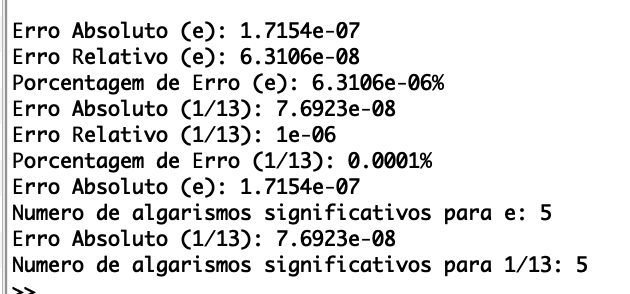

<h1 align="center">
    
</h1>

📌 Exemplos AF1 - Computação numerica
------------------
1. Obtenha limites superiores para o erro absoluto, erro relativo e percentagem de erro das aproximações seguintes:
e = numero de Euler

e ≈ 2.718282

1/13 ≈ 0.076923

(Obs.: Note que e=2.71828182846…..,   1/13 = 0.076923076…..,)

2. Qual o número de algarismos significativos de cada uma das aproximações apresentadas no exercício anterior?

VIDEO:
https://youtu.be/ZsjqeBfxOjk

🔧 Tecnologias utilizadas:
------------------

- <strong>Octave</strong>
- <strong>MacOS</strong>

💬 Fale comigo
------------------
[*Entre em contato comigo*](https://www.linkedin.com/in/ivo-baptista-3712144/)

